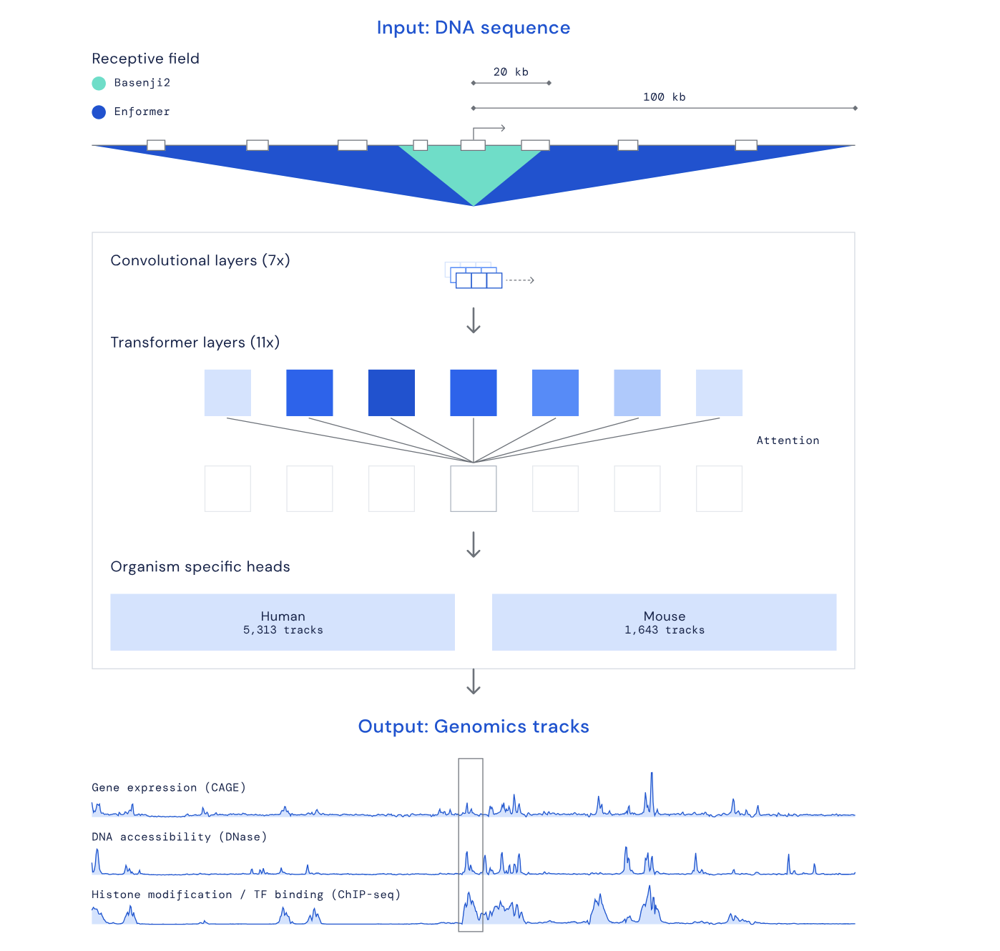

# Build Enformer: A step-by-step guide to build Google Deepmind's Enformer

[Enformer](https://www.nature.com/articles/s41592-021-01252-x#Sec8) is a sequence-based deep learning model capabale of integrating long-range interactions in the genome to improve gene expression prediction. To have a better understanding, in as to how it works, provided a Colab Notebook which goes through layer-by-layer on how to reimplement the Enformer Architecture in PyTorch. Particular attention is payed to explaining how positional encodings function in Enformer, an important componenent to Enformer's success to previous models

Important resources:

[DeepMind's repository](https://github.com/google-deepmind/deepmind-research/tree/master/enformer)
[Lucidrain's repository](https://github.com/lucidrains/enformer-pytorch)